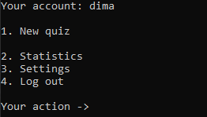
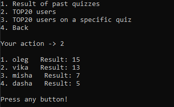
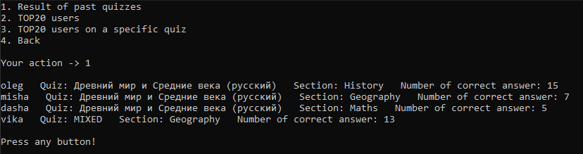
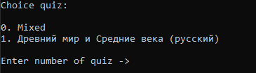
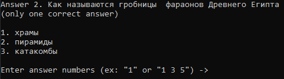

# Quiz

**Основная задача проекта**: хранить словари на разных языках и разрешать пользователю находить перевод нужного слова или фразы

## Features

* [x] При старте приложения пользователь вводит логин и пароль для входа. Если пользователь не зарегистрирован, он должен пройти процесс регистрации.
* [x] При регистрации нужно указать:
	- логин (нельзя зарегистрировать уже существующий логин);
	- пароль;
	- дату рождения.
* [x] После входа в систему пользователь может:
	- стартовать новую викторину;
	- посмотреть результаты своих прошлых викторин;
	- посмотреть Топ-20 по конкретной викторине;
	- изменить настройки. Можно менять пароль и дату рождения;
	- выход
* [x] Для старта новой викторины пользователь должен выбрать раздел знаний
викторины. Например: «История», “География», «Биология» и тд.
* [x] Предусмотреть смешанную викторину, когда вопросы будут выбираться из разных викторин по случайному принципу.
* [x] Конкретная викторина состоит из двадцати вопросов. У каждого вопроса
может быть один или несколько правильных вариантов ответа. Если вопрос предполагает несколько правильных ответов, а пользователь указал
не все, вопрос не засчитывается.
* [] По завершении викторины пользователь получает количество правильно
отвеченных вопросов, а также свое место в таблице результатов игроков
викторины.

* [] Разработать утилиту для создания и редактирования
викторин и их вопросов. Это приложение должно предусматривать вход по логину и паролю.
* [] Пользователи утилиты могут изменять и редактировать только свои викторины.
* [] Предусмотреть суперпользователя, который может изменять и редактировать викторины любых пользователей. При этом он не может принимать участие в викторине.
* [x] Автогенерация викторины и результатов викторин, если файла с викторинами нет.

## Screenshots

